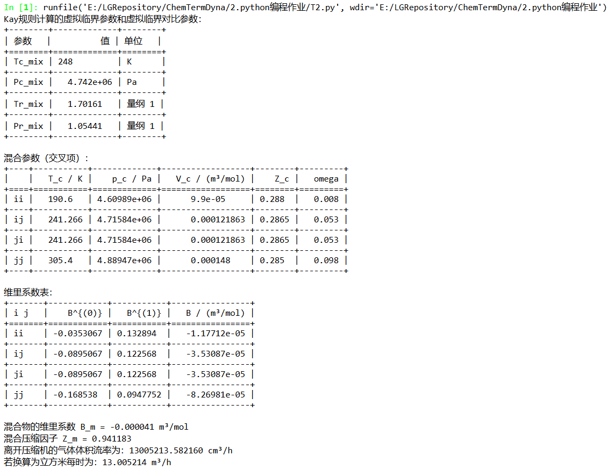

# 化工热力学作业

姓名：刘抗非
班级：122150103
学号：12115990136
课程：化工热力学

---

## 第一题

### 求解思路

已知 **1. 实际混合气体的温度和压力，2. 乙烷和丙烯的临界温度、临界压力和偏心因子，3. 两种气体分子之间的相互作用参数 $k_{12}$**。对于单独组分的摩尔体积求解，直接带入相应的公式即可；**而混合物气体摩尔体积的计算关键在于混合参数的计算**。

#### Virial 方程

维里方程（Virial Equation）适用于低压条件下的气体描述，形式如下：

$$
Z = 1 + \frac{B}{V_m}
$$

对于混合物的维里系数 $B_{\text{mix}}$，可以通过以下混合规则计算：

$$
B_{\text{mix}} = y_1^2 B_1 + y_2^2 B_2 + 2 y_1 y_2 B_{12}
$$

其中 $B_{12} = \sqrt{B_1 B_2} (1 - k_{12})$，$y_1$ 和 $y_2$ 分别是乙烷和丙烯的摩尔分数（在等摩尔混合中均为 0.5）。通过查表获得乙烷和丙烯的维里系数 $B_1$ 和 $B_2$，计算出混合物的 $B_{\text{mix}}$，再将其带入维里方程解得混合物的摩尔体积 $V_m$。

#### Redlich-Kwong (R-K) 方程

Redlich-Kwong (R-K) 方程适用于较高压力下的非理想气体，其表达式为：

$$
P = \frac{RT}{V_m - b} - \frac{a}{\sqrt{T} V_m (V_m + b)}
$$

对于混合物，参数 $a$ 和 $b$ 可通过Prausnitz混合规则计算：

$$
a_{\text{mix}} = y_1^2 a_1 + y_2^2 a_2 + 2 y_1 y_2 a_{12} \\
b_{\text{mix}} = y_1 b_1 + y_2 b_2 \\
a_{12} = \sqrt{a_1 \cdot a_2} \cdot (1 - k_{12}) \\
y_1 = 0.5, y_2 = 0.5 \text{（等摩尔混合）}
$$

在应用 R-K 方程时，需要迭代求解压缩因子 $Z$，从而计算摩尔体积 $V_m$。将 R-K 方程整理后得到一个关于 $Z$ 的三次方程，通过牛顿-拉夫森法进行数值迭代求解：解得 $Z$ 值后，摩尔体积 $V_m$ 可表示为：**$V_m = Z \cdot \frac{RT}{P}$**

#### Soave-Redlich-Kwong (SRK) 方程

将 R-K 方程的解与 SRK 方程作对比，两者的主要区别是 SRK 方程通过引入温度修正因子 $\alpha$ 对 $a$ 参数进行了改进，特别适用于极性分子：

$$
P = \frac{RT}{V_m - b} - \frac{\alpha a}{V_m (V_m + b)} \\
$$

$$
\alpha = \left(1 + m (1 - \sqrt{T_r})\right)^2 \\
T_r = \frac{T}{T_c} \\
m = 0.480 + 1.574 \cdot \omega - 0.176 \cdot \omega^2
$$

### 程序框图


### Python 代码

```python
#%% 导入必要的库
import numpy as np
from scipy.optimize import newton

# 定义常量
R = 8.314  # 气体常数, J/(mol·K)
T = 400.15  # 温度, K
P = 1.5 * 10**6  # 压力, Pa
k12 = 0.15  # 给定的k12值
y_i = 0.5  # 乙烷摩尔分数
y_j = 0.5  # 丙烯摩尔分数

# 乙烷(i)和丙烯(j)的临界参数和偏心因子
Tc_i, Pc_i, Vc_i, Zc_i, omega_i = 305.4, 4.88 * 10**6, 148 * 10**(-6), 0.285, 0.099
Tc_j, Pc_j, Vc_j, Zc_j, omega_j = 365.0, 4.62 * 10**6, 181 * 10**(-6), 0.275, 0.142

# 计算对比温度
Tr_i, Tr_j = T / Tc_i, T / Tc_j

#%%----------------- 维里方程相关 -----------------#%%
# 维里方程相关函数定义
def virial_B0(Tr):
    return 0.083 - (0.422 / Tr**1.6)

def virial_B1(Tr):
    return 0.139 - (0.172 / Tr**4.2)

def virial_B(B0, B1, Tc, Pc, omega):
    return (R * Tc / Pc) * (B0 + omega * B1)

# B_i 和 B_j 计算
B0_i = virial_B0(Tr_i)
B1_i = virial_B1(Tr_i)
B_i = virial_B(B0_i, B1_i, Tc_i, Pc_i, omega_i)

B0_j = virial_B0(Tr_j)
B1_j = virial_B1(Tr_j)
B_j = virial_B(B0_j, B1_j, Tc_j, Pc_j, omega_j)

# 混合规则 (Prausnitz)
Tc_ij = (Tc_i * Tc_j)**0.5 * (1 - k12)
omega_ij = (omega_i + omega_j) / 2
Zc_ij = (Zc_i + Zc_j) / 2
Vc_ij = ((Vc_i**(1/3) + Vc_j**(1/3)) / 2)**3
Pc_ij = Zc_ij * R * Tc_ij / Vc_ij

# B_ij 计算
Tr_ij = T / Tc_ij
B0_ij = virial_B0(Tr_ij)
B1_ij = virial_B1(Tr_ij)
B_ij = virial_B(B0_ij, B1_ij, Tc_ij, Pc_ij, omega_ij)

# 混合维里系数 Bm
Bm = y_i**2 * B_i + 2 * y_i * y_j * B_ij + y_j**2 * B_j

# 维里方程计算摩尔体积
def virial_equation():
    Zm = 1 + (Bm * P) / (R * T)
    V = Zm * R * T / P
    return V

V_virial = virial_equation()
print(f"使用维里方程计算的摩尔体积: {V_virial:.6f} m³/mol")

#%%----------------- R-K 方程相关 -----------------#%%
# 计算RK方程的a和b参数
def calculate_ab_rk(Tc, Pc):
    a = 0.42748 * R**2 * Tc**2.5 / Pc
    b = 0.08664 * R * Tc / Pc
    return a, b

# 计算RK参数
a_i_rk, b_i_rk = calculate_ab_rk(Tc_i, Pc_i)
a_j_rk, b_j_rk = calculate_ab_rk(Tc_j, Pc_j)

# Prausnitz混合规则
def mix_parameters(y1, y2, a1, a2, b1, b2):
    a12 = np.sqrt(a1 * a2) * (1 - k12)
    a_mix = y1**2 * a1 + 2 * y1 * y2 * a12 + y2**2 * a2
    b_mix = y1 * b1 + y2 * b2
    return a_mix, b_mix

a_mix_rk, b_mix_rk = mix_parameters(y_i, y_j, a_i_rk, a_j_rk, b_i_rk, b_j_rk)

# 使用牛顿迭代法求解RK方程
def solve_rk_newton(a, b):
    def f(Z):
        A = a * P / (R**2 * T**2.5)
        B = b * P / (R * T)
        return Z**3 - Z**2 + (A - B - B**2)*Z - A*B
    
    def df(Z):
        A = a * P / (R**2 * T**2.5)
        B = b * P / (R * T)
        return 3*Z**2 - 2*Z + (A - B - B**2)
    
    Z_initial = 1.0
    Z = newton(f, Z_initial, fprime=df)
    V = Z * R * T / P
    return V

V_rk_newton = solve_rk_newton(a_mix_rk, b_mix_rk)
print(f"使用牛顿迭代法求解R-K方程的摩尔体积: {V_rk_newton:.6f} m³/mol")

#%%----------------- SRK 方程相关 -----------------#%%
# 计算SRK方程的a和b参数
def calculate_ab_srk(Tc, Pc, omega, Tr):
    a0 = 0.42747 * R**2 * Tc**2 / Pc
    m = 0.480 + 1.574 * omega - 0.176 * omega**2
    a = a0 * (1 + m * (1 - np.sqrt(Tr)))**2
    b = 0.08664 * R * Tc / Pc
    return a, b

# 计算SRK参数
a_i_srk, b_i_srk = calculate_ab_srk(Tc_i, Pc_i, omega_i, Tr_i)
a_j_srk, b_j_srk = calculate_ab_srk(Tc_j, Pc_j, omega_j, Tr_j)

a_mix_srk, b_mix_srk = mix_parameters(y_i, y_j, a_i_srk, a_j_srk, b_i_srk, b_j_srk)

# 使用牛顿迭代法求解SRK方程
def solve_srk_newton(a, b):
    def f(Z):
        A = a * P / (R**2 * T**2)
        B = b * P / (R * T)
        return Z**3 - Z**2 + (A - B - B**2)*Z - A*B
    
    def df(Z):
        A = a * P / (R**2 * T**2)
        B = b * P / (R * T)
        return 3*Z**2 - 2*Z + (A - B - B**2)
    
    Z_initial = 1.0
    Z = newton(f, Z_initial, fprime=df)
    V = Z * R * T / P
    return V

V_srk_newton = solve_srk_newton(a_mix_srk, b_mix_srk)
print(f"使用牛顿迭代法求解SRK方程的摩尔体积: {V_srk_newton:.6f} m³/mol")
```

Spyder中运行上述代码，输出如下:


## 第二题

### 求解思路

混合物的分子量为:
$$
M = 0.5 \times M_{\text{CH}_4} + 0.5 \times M_{\text{C}_2\text{H}_6} = 0.5 \times 16.04 + 0.5 \times 30.07 = 23.06 \, \text{g/mol}
$$
混合物的流量为:
$$
n = \frac{454}{23.06} = 19.7 \, (\text{kmol} \cdot \text{h}^{-1})
$$
虚拟临界温度和压力为：
$$
T_{p,c,m} = \sum_i y_i T_{c_i} = 0.5 \times 190.56 + 0.5 \times 305.32 = 247.94 \, \text{K} \\
 p_{p,c,m} = \sum_i y_i p_{c_i} = 0.5 \times 4.599 + 0.5 \times 4.872 = 4.736 \, \text{MPa}
$$
虚拟对比参数为：
$$
T_{r,m} = \frac{T}{T_{c}} = \frac{422}{247.94} = 1.702 \\
P_{r,m} = \frac{p}{p_{c}} = \frac{5}{4.736} = 1.056
$$

| $ij$ | $T_{c_{ij}} / \text{K}$ | $p_{c_{ij}} / \text{MPa}$ | $V_{c_{ij}} / (\text{m}^3 \cdot \text{kmol}^{-1})$ | $Z_{c_{ij}}$ | $\omega_{ij}$ |
| ---- | ----------------------- | ------------------------- | -------------------------------------------------- | ------------ | ------------- |
| 11   | 190.56                  | 4.599                     | 0.09860                                            | 0.286        | 0.011         |
| 22   | 305.32                  | 4.872                     | 0.1455                                             | 0.279        | 0.099         |
| 12   | 241.21                  | 4.701                     | 0.1205                                             | 0.2825       | 0.055         |

| i j  | $B^{(0)}$ | $B^{(1)}$ | $B / (\text{m}^3 \cdot \text{kmol}^{-1})$ |
| ---- | --------- | --------- | ----------------------------------------- |
| 11   | -0.0353   | 0.133     | -0.01165                                  |
| 22   | -0.168    | 0.0948    | -0.08287                                  |
| 12   | -0.0894   | 0.1226    | -0.03528                                  |

由混合规则计算$B_{m}$：
$$
\begin{aligned}
B_{m} &= y_1^2 B_{11} + 2 y_1 y_2 B_{12} + y_2^2 B_{22} \\
       &= 0.5^2 \times (-0.01165) + 2 \times 0.5 \times 0.5 \times (-0.03528) + 0.5^2 \times (-0.08287) \\
       &= -0.04127 \, (\text{m}^3 \cdot \text{kmol}^{-1})
\end{aligned}
$$
摩尔体积为：
$$
V = \frac{R T}{p} + B_{m} 
  = \frac{8.314 \times 10^3 \times 422}{5.0 \times 10^6} - 0.04127 
  = 0.6604 \times 10^{-3} \, (\text{m}^3 \cdot \text{kmol}^{-1})
$$
体积流率为：
$$
nV = 19.7 \times 0.6604 = 13.01 \, (\text{m}^3 \cdot \text{h}^{-1})
$$

### 程序框图


### Python 代码

```python
# %% 导入库
import numpy as np
import pandas as pd
from tabulate import tabulate

# %% 常量定义
R = 8.314                        # J/(mol·K)
T = 422                          # K
P = 50 * 1e5                     # Pa
y = np.array([0.5, 0.5])         # 量纲 1
k_ij = 0                         # 量纲 1
m_mix = 454000                   # g
M = np.array([16.04, 30.07])     # g/mol
Tc = np.array([190.6, 305.4])    # K
Pc = np.array([4.600e6, 4.884e6])# Pa
Vc = np.array([99, 148]) * 1e-6  # m³/mol
Zc = np.array([0.288, 0.285])    # 量纲 1
omega = np.array([0.008, 0.098]) # 量纲 1

# %% Kay规则计算虚拟临界参数
def kay_rule(y, params):
    return np.sum(y * params)

Tc_mix = kay_rule(y, Tc)
Pc_mix = kay_rule(y, Pc)

# 计算虚拟临界对比参数
Tr_mix = T / Tc_mix
Pr_mix = P / Pc_mix

# 输出虚拟临界参数和虚拟临界对比参数
print("Kay规则计算的虚拟临界参数和虚拟临界对比参数：")
kay_params = {
    "参数": ["Tc_mix", "Pc_mix", "Tr_mix", "Pr_mix"],
    "值": [Tc_mix, Pc_mix, Tr_mix, Pr_mix],
    "单位": ["K", "Pa", "量纲 1", "量纲 1"]
}
print(tabulate(pd.DataFrame(kay_params), headers='keys', tablefmt='grid', showindex=False))
print()

# %% Prausnitz混合规则计算交叉项
def prausnitz_mixture_params(Tc, Pc, Vc, Zc, omega, k_ij):
    Tc_ij = np.sqrt(np.outer(Tc, Tc)) * (1 - k_ij)
    Vc_ij = ((np.cbrt(Vc[:, None]) + np.cbrt(Vc)) / 2)**3
    Zc_ij = (Zc[:, None] + Zc) / 2
    Pc_ij = Zc_ij * R * Tc_ij / Vc_ij
    omega_ij = (omega[:, None] + omega) / 2
    return np.stack([Tc_ij, Pc_ij, Vc_ij, Zc_ij, omega_ij], axis=-1)

# 计算混合参数（交叉项）
mixture_params_table = prausnitz_mixture_params(Tc, Pc, Vc, Zc, omega, k_ij)
columns = ["T_c / K", "p_c / Pa", "V_c / (m³/mol)", "Z_c", "omega"]
df_params = pd.DataFrame(mixture_params_table.reshape(-1, 5),
                         index=["ii", "ij", "ji", "jj"], columns=columns)

# 使用 tabulate 输出混合参数（交叉项）
print("混合参数（交叉项）：")
print(tabulate(df_params, headers='keys', tablefmt='grid', showindex=True))

# %% 计算第二维里系数 B（适用于纯物质）
def virial_B0(Tr):
    return 0.083 - (0.422 / Tr**1.6)

def virial_B1(Tr):
    return 0.139 - (0.172 / Tr**4.2)

def virial_B(Tc, Pc, B0, B1, omega):
    return (R * Tc / Pc) * (B0 + omega * B1)

# 对比温度矩阵
Tr_matrix = T / mixture_params_table[..., 0]

# 计算B0和B1矩阵
B0_matrix = virial_B0(Tr_matrix)
B1_matrix = virial_B1(Tr_matrix)

# 计算维里系数矩阵B
B_matrix = virial_B(mixture_params_table[..., 0], mixture_params_table[..., 1],
                    B0_matrix, B1_matrix, mixture_params_table[..., 4])

# 表格显示第二维里系数
B_table_data = {
    "i j": ["ii", "ij", "ji", "jj"],
    "B^{(0)}": B0_matrix.flatten(),
    "B^{(1)}": B1_matrix.flatten(),
    "B / (m³/mol)": B_matrix.flatten()
}
df_B = pd.DataFrame(B_table_data)

# 使用 tabulate 输出维里系数表
print("\n维里系数表：")
print(tabulate(df_B, headers='keys', tablefmt='grid', showindex=False))

# %% 混合维里系数 B_m
def mix_virial_B_m(y, B_matrix):
    return np.dot(y, np.dot(B_matrix, y))

# 计算混合物的 B_m
B_m = mix_virial_B_m(y, B_matrix)
print(f"\n混合物的维里系数 B_m = {B_m:.6f} m³/mol")

# %% 计算混合压缩因子 Z_m 和体积流量
def calculate_Z(B_m, P, T):
    return 1 + (B_m * P) / (R * T)

def calculate_volume_flow(Z, P, T, m_mix, M, y):
    M_mix = np.dot(y, M)
    n_total = m_mix / M_mix
    Vm_mix = (R * T) / P * Z
    V_total = Vm_mix * n_total
    volume_flow_mix = V_total * 1e6
    return volume_flow_mix

# 计算压缩因子 Z
Z_m = calculate_Z(B_m, P, T)
print(f"混合压缩因子 Z_m = {Z_m:.6f}")
# 计算体积流量
volume_flow_mix = calculate_volume_flow(Z_m, P, T, m_mix, M, y)

print("离开压缩机的气体体积流率为：{:.6f} cm³/h".format(volume_flow_mix))
print("若换算为立方米每时为：{:.6f} m³/h".format(volume_flow_mix / 1e6))
```

Spyder中运行上述代码，输出如下:


